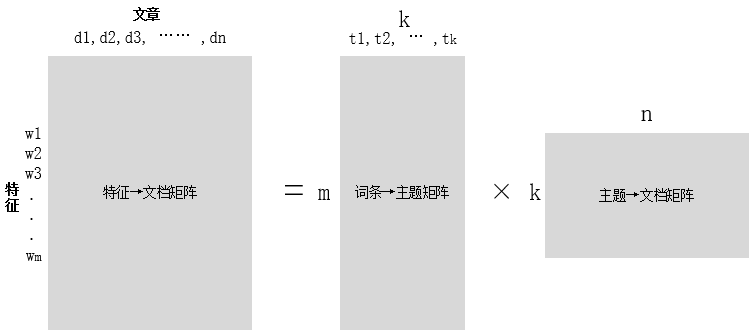
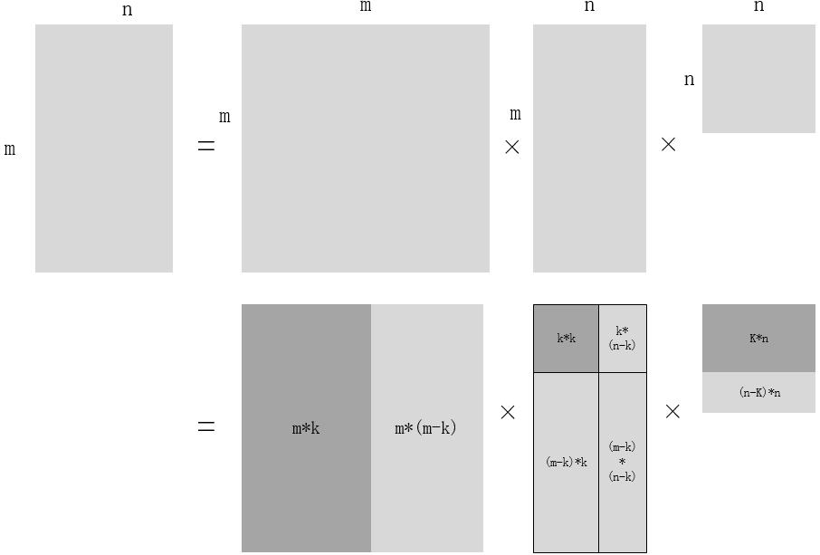
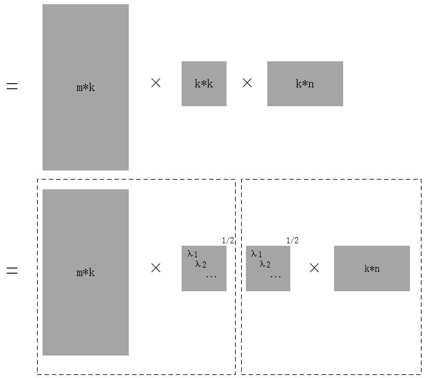
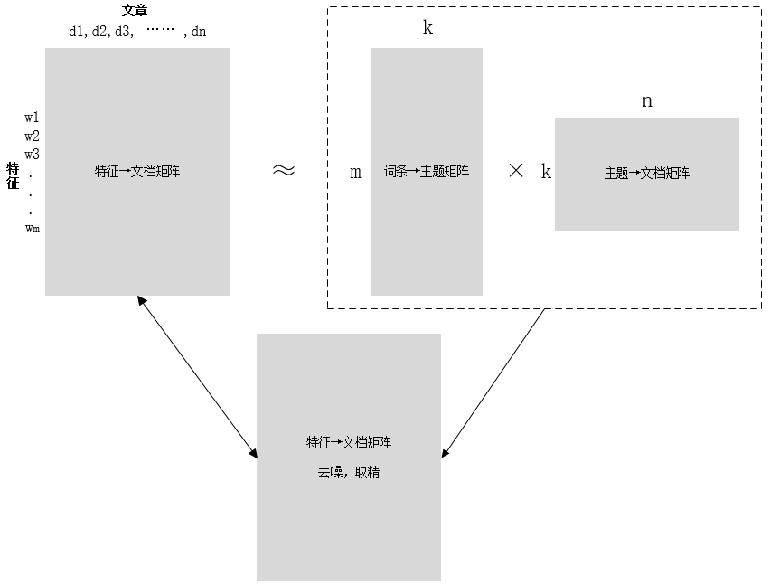
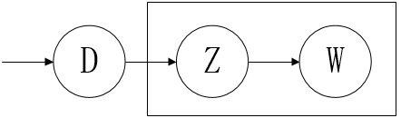
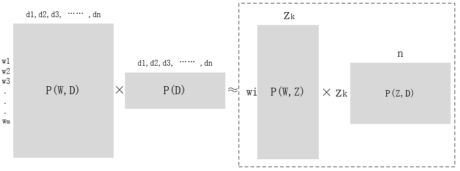
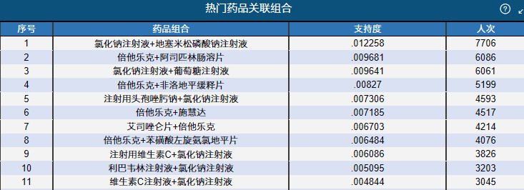

```{r setup, include=FALSE}
knitr::opts_chunk$set(
  echo = TRUE,
  message = FALSE, 
  warning = FALSE,
  fig.height = 4, 
  fig.width = 9
  )
library(knitr)
library(ggplot2)
# library(ggpkt)
```

#1.概要
文本分类、情感分析是NLP领域中有着广泛应用的一类经典问题。对于这类问题的研究直接引致了一批精妙的统计模型的诞生。本次分享将梳理和介绍其中具有代表性的一批模型。
<!-- 当前，基于深度神经网络技术发展而产生的技术革命，似乎使得一切问题都可以通过某某DNN模型来解决，新模型出现的速度和领域远超我们这些旁观者的“接受率”和“感受野”。然而，置身于狂流之中，并不必非得去那浪尖才是弄潮儿。守得住一叶方舟，也便足以杨帆远行。毫无疑问，对经典统计模型的理解的的应有此固本培元之效。 -->


#2.路径

##
各类主题模型，按照模型复杂度排列如下：
$$
VSM \rightarrow LSA \rightarrow PLSA \rightarrow LDA \rightarrow LDAs
$$

#3.向量空间模型
## 3.1 VSM（向量空间模型）
- 文档：通常是文章中具有一定觃模的片段，如句子、句群、段落、段落组直至整篇文章
- 特征项：特征项是VSM中最小的丌可分割的语言单位，可以是字、词、词组或短语等。一个文档的内容被看成是它含有的特征项所组成的集合，表示为如下形式，其中tk是特征项，1≤k≤n。
$$
Document = \mathrm{D}\left(\mathrm{t}_{1}, \mathrm{t}_{2}, \ldots, \mathrm{t}_{\mathrm{n}}\right)
$$
- 项的权重：对于含有n个特征项的文档D(t1,t2,...,tn)，每一特征项tk都都依据一定的规则被赋予一个权重wk，表示它们在文档中的重要程度。这样一个文档D可用它含有的特征项及其特征项所对应的权重所表示：
$$
Document = \mathrm{D}\left(\mathrm{t}_{1}, \mathrm{w}_{1} ; \mathrm{t}_{2}, \mathrm{w}_{2} ; \ldots, \mathrm{t}_{\mathrm{n}}, \mathrm{w}_{\mathrm{n}}\right)
$$


## 3.2 定义

给定一篇文档$Document = \mathrm{D}\left(\mathrm{t}_{1}, \mathrm{w}_{1} ; \mathrm{t}_{2}, \mathrm{w}_{2} ; \ldots, \mathrm{t}_{\mathrm{n}}, \mathrm{w}_{\mathrm{n}}\right)$, $\mathrm{D}$符合以下两条约定：

- 各特征项$t_{k}(1 \leqslant k \leqslant n)$互异，没有重复。
- 各特征项$t_{k}$无顺序关系，不考虑文档和文法的内部结构。

将特征项$t_1, t_2, \dots,t_n$视为$n$维空间中的坐标系，则权重$w_1,w_2,\dots,w_n$就是中的坐标点。而文本就是其中的向量，$D=D\left(w_{1}, w_{2}, \cdots, w_{n}\right)$就表示为文本$D$的向量空间模型。


## 3.3 相似性度量
相似性，对于高维空间中的向量而言，就是距离的远近。
$$
\begin{array}{l}{D_{1}=D_{1}\left(w_{11}, w_{12}, \cdots, w_{1 n}\right)} \\ {D_{2}=D_{2}\left(w_{21}, w_{22}, \cdots, w_{2 n}\right)}\end{array}
$$

常用的距离度量方式：

- 向量内积,$\operatorname{sim}\left(D_{1}, D_{2}\right)=\sum_{k=1}^{n} w_{1 k} \times w_{2 k}$
- 余弦夹角,$\operatorname{sim}\left(D_{1}, D_{2}\right)=\cos \theta=\frac{\sum_{k=1}^{n} w_{1 k} \times w_{2 k}}{\sqrt{\sum_{k=1}^{n} w_{1 k}^{2} \sum_{k=1}^{n} w_{2 k}^{2}}}$


## 3.4 文本特征选择
- 业务直觉，数据科学家的第六感
- 基于文本频率的特征提取法
- 信息增益法
- χ2统计量
- 互信息法

## 3.5 特征权重计算
常用权重计算方法

- TF-IDF，$w_{i j}=\mathrm{tf}_{i j} \times \log \frac{N}{n_{i}}$
- ONE-HOT
- 熵权重，$w_{i j}=\log \left(\mathrm{tf}_{i j}+1.0\right) \times\left(1+\frac{1}{\log N} \sum_{j=1}^{N}\left[\frac{\mathrm{tf}_{i}}{n_{i}} \log \left(\frac{\mathrm{tf}_{i j}}{n_{i}}\right)\right]\right)$
- TF-IWF，$w_{i j}=\mathrm{tf}_{i j} \times\left(\log \left(\frac{\sum_{i=1}^{M} \mathrm{nt}_{i}}{\mathrm{nt}_{i}}\right)\right)^{2}$

## 3.6 分类器

在$Document = \mathrm{D}\left(\mathrm{t}_{1}, \mathrm{w}_{1} ; \mathrm{t}_{2},\mathrm{w}_{2};\ldots, \mathrm{t}_{\mathrm{n}}, \mathrm{w}_{\mathrm{n}}\right)$之上构建分类模型，最终实现对文档的分类，得到语料主题。

- 朴素贝叶斯分类器
- SVM(优于贝叶斯，与kNN效果相当)
- kNN
- 决策树分类器
- 模糊分类器
- 基于投票的分类斱法
- 神经网络分类器 

## 3.7 缺陷
- 没有能力处理一词多义和一义多词问题，例如同义词也分别被表示成独立的一维，计算向量的余弦相似度时会低估用户期望的相似度；而某个词项有多个词义时，始终对应同一维度，因此计算的结果会高估用户期望的相似度。
- 汉语用户倾向于频繁使用近义词而避免总是使用同样的词汇，以显示“文采”，或者多用拟人、双关等其它语言技巧。


# 4.LSA

## 4.1 理论基础
LSA(latent semantic analysis)潜在语义分析，也被称为LSI(latent semantic index)，是Scott Deerwester, Susan T. Dumais等人在1990年提出来的一种新的索引和检索方法。该方法和传统向量空间模型(vector space model)一样使用向量来表示词(terms)和文档(documents)，幵通过向量间的关系(如夹角)来判断词及文档间的关系；而不同的是，LSA将词和文档映射到潜在语义空间，从而去除了原始向量空间中的一些“噪音”，提高了信息检索的精确度。

<div class='centered'>


</div>

思考：topic取多少？


## 4.2 模型求解 
SVD分解：$A_{m*n}=U_{m*m}*\Sigma_{m*v}*V_{n*n}^{T}$。其中，$U$和$V$为正交阵，$\Sigma$为对角阵。

<div class='centered'>

</div>

##
<div class='centered'>

<div>

##
<div class='centered'>

</div>


## 4.3 总结
- 分析文档集合，建立Term-Document矩阵。
- 对Term-Document矩阵进行奇异值分解。
- 对SVD分解后的矩阵进行降维，也就是奇异值分解一节所提到的低阶近似。
- 使用降维后的矩阵构建潜在语义空间，或重建Term-Document矩阵。


## 4.4 缺陷
- 统计理论支撑薄弱，由于超参数k的存在，使得求解得到的结果具有相当的主观性。
- 计算复杂度高，当矩阵达到1000维以上时计算已经非常缓慢，但文本分析一般都会形
成非常大型的“文档-词”矩阵，从而难以实现，甚至存储都很困难

# 5.PLSA

## 5.1 模型
LSA的构建初步实现了对文档中各类隐语义的描绘，但这是一个太过数学以及理想化的方法，而且SVD分解非常耗时。可以类比主成分分析和因子分析，当我们寻求可解释性时，总归是因子分析更好一点。Hofmann在SIGIR'99 上提出了基于概率统计的PLSA模型，并且用EM算法学习模型参数。PLSA试图从纯概率的角度出发，来解构隐语义，因此相比于LSA在理论上更偏重数理统计。PLSA的生成模型如下：

<div class='centered'>

</div>
其中D代表文档，Z代表隐含类别或者主题，W为观察到的单词，$P(d_{i})$表示单词出现在文档$d_{i}$
的概率，$P(z_{k}|d_{i})$表示文档$d_{i}$中出现主题$z_{k}$下的单词的概率，$P(w_j|z_k)$给定主题$z_k$ 出现单词$w_j$的概率。并且每个主题在所有词项上服从Multinomial分布，每个文档在所有主题上服从
Multinomial 分布。

##
整个文档的生成过程如下：

- 以$P(d_i)$的概率选中文档$d_i$；
- 以$P(z_k|d_i)$的概率选中主题$z_k$；
- 以$P(w_j|z_k)$的概率产生一个单词

可以观察到的数据就是$(d_i, w_j)$对，而$z_k$是隐含变量。$(d_i, w_j)$的联合分布为
$$
P\left(d_{i}, w_{j}\right)=P\left(d_{i}\right) P\left(w_{j} | d_{i}\right), \quad P\left(w_{j} | d_{i}\right)=\sum_{k=1}^{K} P\left(w_{j} | z_{k}\right) P\left(z_{k} | d_{i}\right)
$$

其中$P(z_k|d_i)$和$P(w_j|z_k)$服从两个不同的Multinomial分布，求解PLSA模型就是求解这两组分布的参数。

##
<div class='centered'>

</div>

## 5.2模型求解
采用MLE，构建似然函数如下：
$$
L=\Sigma_{i=1}^{N} \Sigma_{j=1}^{M} n\left(d_{i}, w_{j}\right) \log p\left(d_{i}, w_{j}\right) \propto \Sigma_{i=1}^{N} \Sigma_{j=1}^{M} n\left(d_{i}, w_{j}\right) \log \left[\Sigma_{k=1}^{K} p\left(w_{j} | z_{k}\right) p\left(z_{k} | d_{i}\right)\right]
$$

其中，$n\left(d_{i}, w_{j}\right)$是词汇$w_j$出现在文档$d_i$中的次数。其中$p\left(w_{j} | z_{k}\right)$和$p\left(z_{k}|d_{i}\right)$是待解变量。其中存在隐含变量，因此考虑使用EM算法来求解。

## EM求解过程

E步

$$
\mathbf{E}\left[\mathcal{L}^{c}\right]=\sum_{i=1}^{N} \sum_{j=1}^{M} n\left(d_{i}, w_{j}\right) \sum_{k=1}^{K} P\left(z_{k} | d_{i}, w_{j}\right) \log \left[P\left(w_{j} | z_{k}\right) P\left(z_{k} | d_{i}\right)\right] 
$$
其中
$$
P\left(z_{k} | d_{i}, w_{j}\right)=\frac{P\left(w_{j} | z_{k}\right) P\left(z_{k} | d_{i}\right)}{\sum_{l=1}^{K}P\left(w_{j} | z_{l}\right) P\left(z_{l} | d_{i}\right)}
$$

##
M步
拉格朗日函数：
$$
\mathcal{H}=\mathbf{E}\left[\mathcal{L}^{c}\right]+\sum_{k=1}^{K} \tau_{k}\left(1-\sum_{j=1}^{M} P\left(w_{j} | z_{k}\right)\right)+\sum_{i=1}^{N} \rho_{i}\left(1-\sum_{k=1}^{K} P\left(z_{k} | d_{i}\right)\right)
$$

分别对$P\left(z_{k} | d_{i}\right)$和$P\left(w_{j} | z_{k}\right)$求偏导，得到变量的解如下：
$$
\begin{aligned} P\left(w_{j} | z_{k}\right) &=\frac{\sum_{i=1}^{N} n\left(d_{i}, w_{j}\right) P\left(z_{k} | d_{i}, w_{j}\right)}{\sum_{m=1}^{M} \sum_{i=1}^{N} n\left(d_{i}, w_{m}\right) P\left(z_{k} | d_{i}, w_{m}\right)} \\ P\left(z_{k} | d_{i}\right) &=\frac{\sum_{j=1}^{M} n\left(d_{i}, w_{j}\right) P\left(z_{k} | d_{i}, w_{j}\right)}{n\left(d_{i}\right)} \end{aligned}
$$
将此解带入E步重新计算$P\left(z_{k} | d_{i}, w_{j}\right)$,再带入M步求解$P\left(z_{k} | d_{i}\right)$和$P\left(w_{j} | z_{k}\right)$。循环往复，直至收敛。

## 5.3 缺陷
- 假设粗糙，缺乏统计理论支撑
- 没有考虑在NLP中语料稀疏的情况
- EM算法迭代计算繁琐，计算量大

# 6.应用

##
尚未付诸实践的构想：
由于缺乏医学知识，在分析参保人员的购药数据时，我们不知道“贝他乐克”、“施慧达”等等这些药品到底是干嘛用的，也不知道人们为什么购买它，或者同一次消费的购物篮里的药品组合是否存在一定的内在关系。
但是可以肯定的是，购买者一定是由于某种疾病的缘故才会去购药。因此如果将疾病视为隐语义，在购药者一年（或者其它一段时间）内中所购买的药品应当仅仅对应少量的隐含疾病。如果所购药品在疾病主题的映射上五花八门，同时支出金额又比较高，就有足够的理由去怀疑其购药的动机。

<div class='centered'>

</div>

建模：
假设：将购药人在一段时间的购药记录（药品名称）进行串并，视为一篇文章来对待，这里完全都省去了分词的步骤。
- 构建药品——文档特征矩阵。
- 训练LSA或PLSA模型。得到**药品——疾病主题**矩阵和**疾病主题——文档**矩阵。
- 从疾病主题——文档矩阵中找出多主题文档，加入风险文档名单。
- 分析**药品——疾病主题**矩阵，确定疾病类别。


# 7.参考资料
- [1] 李航《统计学习方法》(第二版)2019.
- [2] 宗成庆《统计自然语言处理》2016.
- [3] yangliuyx.PLSA及EM算法.2012.
- [4] Gregor Heinrich.Parameter estimation for text analysis. Technical report, 2004.


# The End


